# Eind project API

## Beschrijving gekozen thema
Het onderwerp dat ik gekozen heb is een spel genaamd Tom Clancy's Rainbow Six Siege. Ik heb hiermee een aantal GET requests gemaakt waardoor je alle spelers en operators kan weergeven, ook kan je door middel van een player ID alle informatie van een speler opvragen (het wachtwoord word niet getoont). Door het ID van de favorite map mee te geven komt de naam van de map te staan onder de input, je kan ook met een een map ID de naam van een map zoeken. Met mijn laatste GET request kan je een willekeurig cijfer meegeven, het cijfer dat je meegeeft is het aantal maps met hun ID die getoont worden. Als je een getal meegeeft dat groter is dan dat er maps zijn dan worden de maps onder elkaar in volgorde weergegeven. Ik heb ook 3 POST requests gemaakt, zodat je een player, operator en een map kan aanmaken. Ik heb ook gebruik gemaakt van een PUT en DELETE zodat je de player informatie kan wijzigen of verwijderen. Wachtwoorden worden gehashed en sommige requests vereisen een authenticatie.
## Uitbreiding:
Ik heb een front end gemaakt waar alle GET en POST requests opstaan en deze gehost op Netlify (zie Links), ik heb deze ook een style gegeven.

<br />

### Links:
### website (hosted op netlify): [Klik hier](https://meek-basbousa-ebf34a.netlify.app/)

### hosted API: [Klik hier](https://cloud.okteto.com/?_gl=1*1jwnjs*_ga*MTUyMzAzNjk3OS4xNjY2OTU0NTIw*_ga_KSKZWJHTJZ*MTY3MzAyMDQxMS4xNS4wLjE2NzMwMjA0MTEuMC4wLjA.#/spaces/dennisraaijmakers?resourceId=c4923ad4-f201-4f7e-8779-1321a22736b5)

### Front end op github: [Klik hier](https://github.com/DennisRaaijmakers/api_eindproject_webpagina)

<br />

## OpenAPI screenshot:
Hier zie je een screenshot van OpenAPI docs:
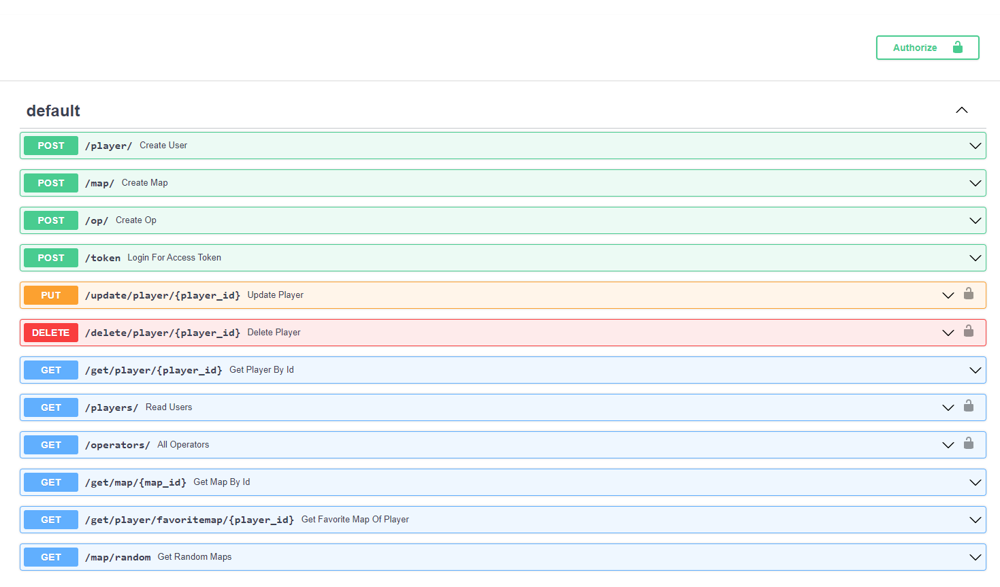


## GET requests:
1. Get player by id
Als je een player ID meegeeft krijg je de informatie over een player.
Dit heb ik gedaan door deze link in te geven: ```https://system-service-dennisraaijmakers.cloud.okteto.net/get/player/1```<br />
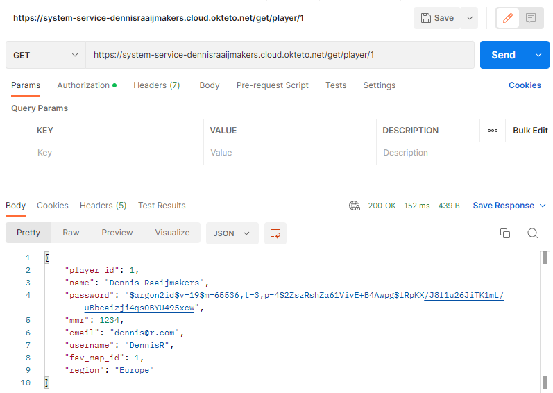
Zo ziet het eruit als ik het op de website doe:<br />
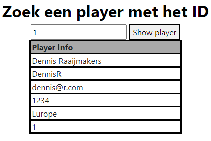

2. Get all players
Dit word beveiligd met authenticatie als je een token ingeeft kan je pas alle players zien.
Dit heb ik gedaan door deze link in te geven: ```https://system-service-dennisraaijmakers.cloud.okteto.net/players/```

Zonder authenticatie:<br />
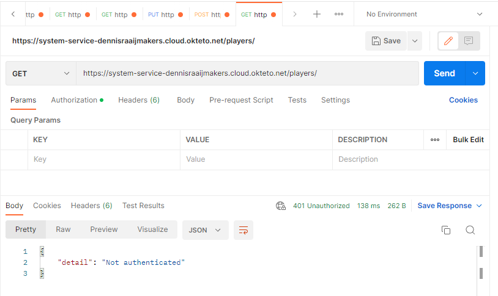
Met authenticatie:<br />
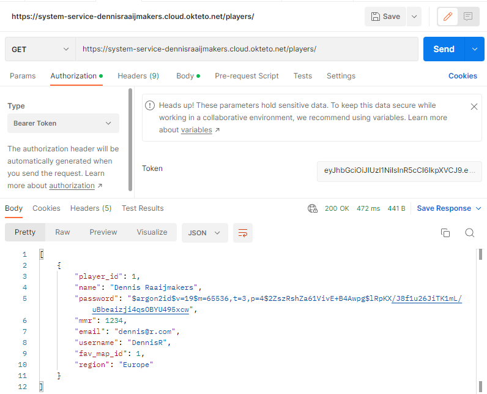
Op de website:<br />
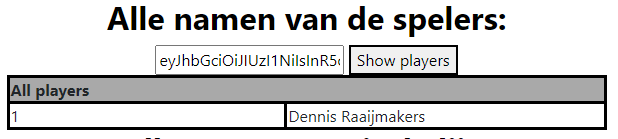

3. Get all operators
Het principe is hetzelfde als Get all players. Door een token mee te geven krijg je alle opertors te zien ander krijg je een "not authenticated" error.

De link die ik gebruik heb hiervoor is : ```https://system-service-dennisraaijmakers.cloud.okteto.net/operators/```<br />
Zonder authenticatie:<br />
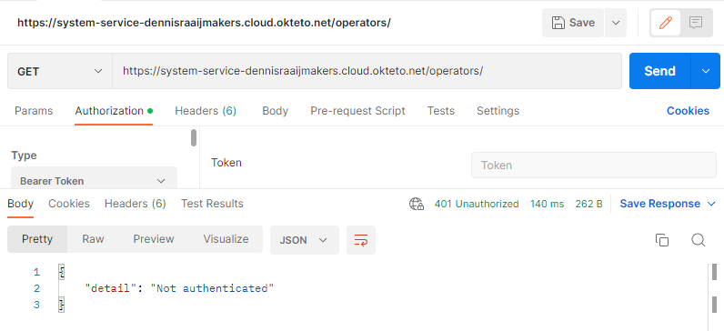<br />
Met authenticatie:<br />
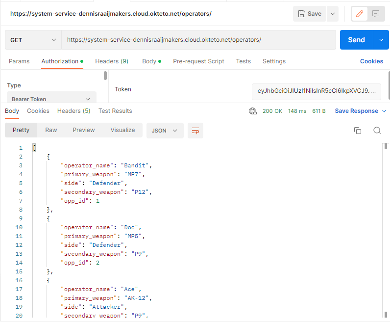<br />
Op de website:<br />
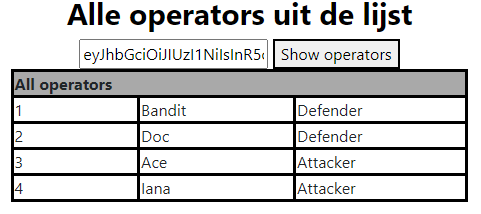<br />

4. Get map by id
Door het ID van de map in te geven krijg je de naam van de map te zien.

De link die ik gebruik heb hiervoor is : ```https://system-service-dennisraaijmakers.cloud.okteto.net/get/map/1```<br />

Op postman: <br />
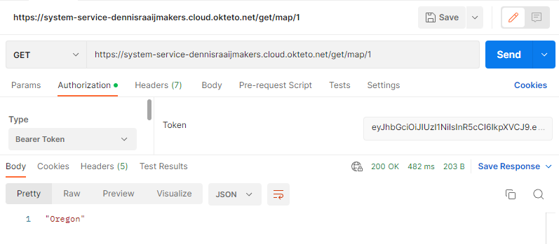<br />
Op de website: <br />
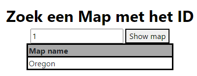<br />

5. Get favorite map of player
Bij deze GET request wordt er gebruik gemaakt van query parameter. Met deze GET request vraag je een random aantal maps, het aantal kan je zelf kiezen. Als je niks ingeeft dan zal er altijd 1 map getoont worden omdat de default waarde 1 is.

Op postman: <br />
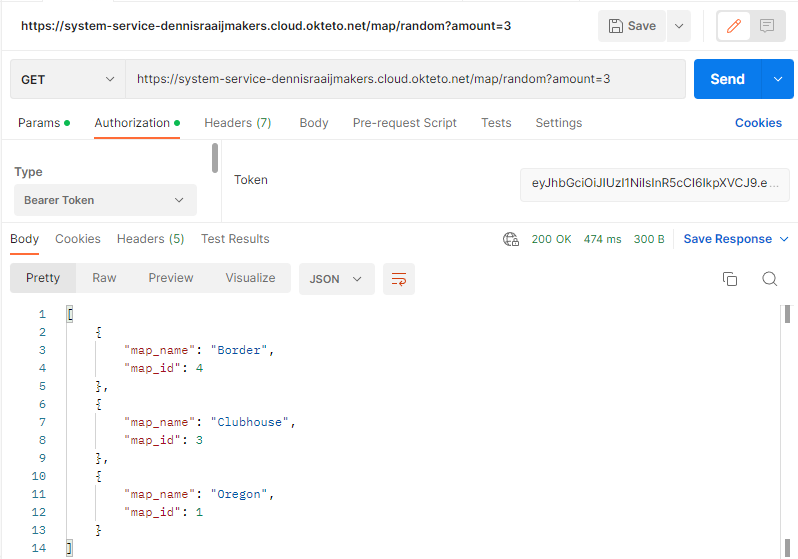<br />
Op de website: <br />
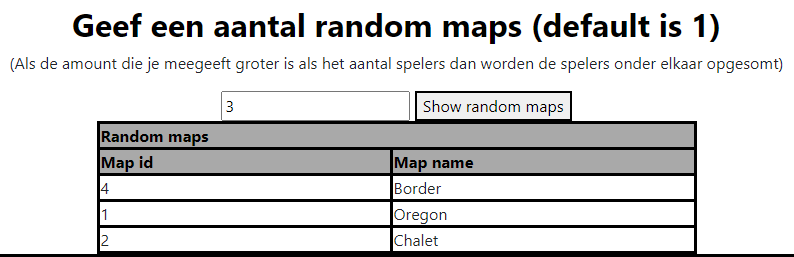<br />

hier zie je een voorbeeld als je een hoger getal meegeeft als dat er maps in de database zijn. <br />
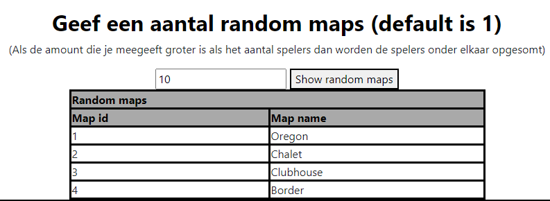<br />

6. Get random map


## POST requests:

## DELETE request:

## PUT request:


