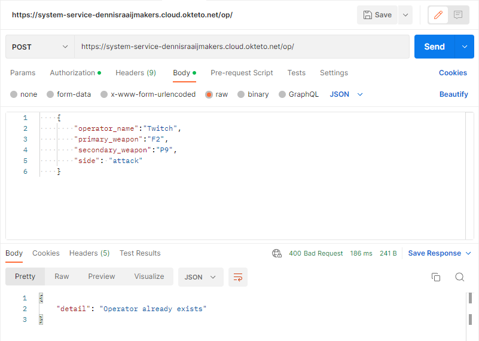

# Eind project API

## Beschrijving gekozen thema
Het onderwerp dat ik gekozen heb is een spel genaamd Tom Clancy's Rainbow Six Siege. Ik heb hiermee een aantal GET requests gemaakt waardoor je alle spelers en operators kan weergeven, ook kan je door middel van een player ID alle informatie van een speler opvragen (het wachtwoord word niet getoont). Door het ID van de favorite map mee te geven komt de naam van de map te staan onder de input, je kan ook met een een map ID de naam van een map zoeken. Met mijn laatste GET request kan je een willekeurig cijfer meegeven, het cijfer dat je meegeeft is het aantal maps met hun ID die getoont worden. Als je een getal meegeeft dat groter is dan dat er maps zijn dan worden de maps onder elkaar in volgorde weergegeven. Ik heb ook 3 POST requests gemaakt, zodat je een player, operator en een map kan aanmaken. Ik heb ook gebruik gemaakt van een PUT en DELETE zodat je de player informatie kan wijzigen of verwijderen. Wachtwoorden worden gehashed en sommige requests vereisen een authenticatie.
## Uitbreiding:
Ik heb een front end gemaakt waar alle GET en POST requests opstaan en deze gehost op Netlify (zie Links), ik heb deze ook een style gegeven.

<br />

### Links:
### website (hosted op netlify): [Klik hier](https://meek-basbousa-ebf34a.netlify.app/)

### hosted API: [Klik hier](https://cloud.okteto.com/?_gl=1*1jwnjs*_ga*MTUyMzAzNjk3OS4xNjY2OTU0NTIw*_ga_KSKZWJHTJZ*MTY3MzAyMDQxMS4xNS4wLjE2NzMwMjA0MTEuMC4wLjA.#/spaces/dennisraaijmakers?resourceId=c4923ad4-f201-4f7e-8779-1321a22736b5)

### Front end op github: [Klik hier](https://github.com/DennisRaaijmakers/api_eindproject_webpagina)

<br />

## OpenAPI screenshot:
Hier zie je een screenshot van OpenAPI docs:


## GET requests:
1. **Get player by id** <br />
Als je een player ID meegeeft krijg je de informatie over een player.
Dit heb ik gedaan door deze link in te geven: ```https://system-service-dennisraaijmakers.cloud.okteto.net/get/player/1```<br />

Zo ziet het eruit als ik het op de website doe:<br />


2. **Get all players** <br />
Dit word beveiligd met authenticatie als je een token ingeeft kan je pas alle players zien.
Dit heb ik gedaan door deze link in te geven: ```https://system-service-dennisraaijmakers.cloud.okteto.net/players/```

Zonder authenticatie:<br />

Met authenticatie:<br />

Op de website:<br />


3. **Get all operators** <br />
Het principe is hetzelfde als Get all players. Door een token mee te geven krijg je alle opertors te zien ander krijg je een "not authenticated" error.

De link die ik gebruik heb hiervoor is : ```https://system-service-dennisraaijmakers.cloud.okteto.net/operators/```<br />
Zonder authenticatie:<br />
<br />
Met authenticatie:<br />
<br />
Op de website:<br />
<br />

4. **Get map by id** <br />
Door het ID van de map in te geven krijg je de naam van de map te zien.

De link die ik gebruik heb hiervoor is : ```https://system-service-dennisraaijmakers.cloud.okteto.net/get/map/1```<br />

Op postman: <br />
<br />
Op de website: <br />
<br />
 
5. **Get favorite map of player** <br />
Deze GET request geeft de favorite map van een speler weer door het ID van de speler in te geven.<br />
De link die ik hiervoor gebruik is: ```https://system-service-dennisraaijmakers.cloud.okteto.net/get/player/favoritemap/2``` <br />

Op postman: <br />
<br />
Op de website: <br />
<br />

**Verduidelijking** <br />

In dit voorbeeld heb ik player 2 gebruikt.
Zoals je op de foto kan zien is de favorite map ID van player 2 het nummer 3.<br />
<br />

En zoals je op deze foto kan zien is de map met het ID 3 de map Clubhouse:
<br />

6. **Get random map** <br />
Bij deze GET request wordt er gebruik gemaakt van query parameter. Met deze GET request vraag je een random aantal maps, het aantal kan je zelf kiezen. Als je niks ingeeft dan zal er altijd 1 map getoont worden omdat de default waarde 1 is.<br />
De link die ik hiervoor gebruik is: ```https://system-service-dennisraaijmakers.cloud.okteto.net/map/random?amount=3``` <br />

Op postman: <br />
<br />
Op de website: <br />
<br />

hier zie je een voorbeeld als je een hoger getal meegeeft als dat er maps in de database zijn. <br />
<br />


## POST requests:
1. **Create player** <br />
Met deze POST request kan je een player aanmaken. Er zijn wel een paar eissen zoals: het mag niet dezelfde username hebben als iemand anders en ook niet het zelfde email adres. Na het maken worden de waardes terug gegeven behalve het wachtwoord.<br />

Voorbeeld JSON voor als body in postman: <br />

<pre>
{
    "fav_map_id": 2,
    "username": "player",
    "name": "player",
    "email": "player@test.com",
    "password": "abc123!",
    "region": "Europe",
    "mmr": 1234
}
</pre>
(Het player ID wordt automatisch genummerd) <br />

Op postman: <br />
<br />

Op de website: <br />
(in de inputs moet je de gegevens invullen die gevraagd worden) <br />
<br />
    
2. **Create map** <br />
Bij deze POST request kan je een map aanmaken. Hier is ook een eis, de map die je aanmaakt mag nog niet bestaan. <br />
Voorbeeld JSON voor als body in postman: <br />
<pre>
{
    "map_name": "border"
}
</pre>

Op postman: <br />
 <br />

Op de website: <br />
(in de inputs moet je de gegevens invullen die gevraagd worden) <br />
 <br />


3. **Create operator** <br />
Met deze POST request kan een een operator aanmaken. Er is hier ook een eis en dat is dat de naam van de operator niet al mag bestaan in de database. <br />

Voorbeeld JSON voor als body in postman: <br />
<pre>
{
    "operator_name":"Twitch",
    "primary_weapon":"F2",
    "secondary_weapon":"P9",
    "side": "attack"
}
</pre>

Op postman: <br />
 <br />

Op de website: <br />
(in de inputs moet je de gegevens invullen die gevraagd worden) <br />
 <br />

Als ik vervolgens nog eens op send klik met dezelfde gegevens krijg ik een error: <br />
 <br />

4. **Login token** <br />
Met deze POST request kan je een token aanvragen zodat je bepaalde dingen wel kan zien, als je die token meegeeft dan ben je geauthenticeerd. De token krijg je enkel als je een player hebt gemaakt en dan met het email en password inlogt van die speler.

 <br />

Nadat deze inlog succesvol is krijg je een token terug gestuurd. Als je deze token in geeft dan werken de requests waar je eerst niet geauthenticeerd voor was nu wel.<br />

 <br />

 <br />

## PUT request:
In de PUT request kan je een player aanpassen.<br />
In dit voor beeld heb ik de favorite map, username en het aantal mmr aangepast:<br />
Before: <br />
 <br />
Put request: <br />
 <br />
After: <br />
 <br />

De gebruikte link: <br />
```https://system-service-dennisraaijmakers.cloud.okteto.net/update/player/1``` <br />

## DELETE request:
Met deze DELETE request kan je een player deleten door in de link het player ID van de speler die je wilt deleten weg te doen.<br />
Gebruikte link: <br />
```https://system-service-dennisraaijmakers.cloud.okteto.net/delete/player/1``` <br />
Hier zie je dat ik player 1 gedelete heb: <br />
 <br />
Checken of de player weg is in postman: <br />
 <br />
Checken of de player weg is op de website: <br />
 <br />

